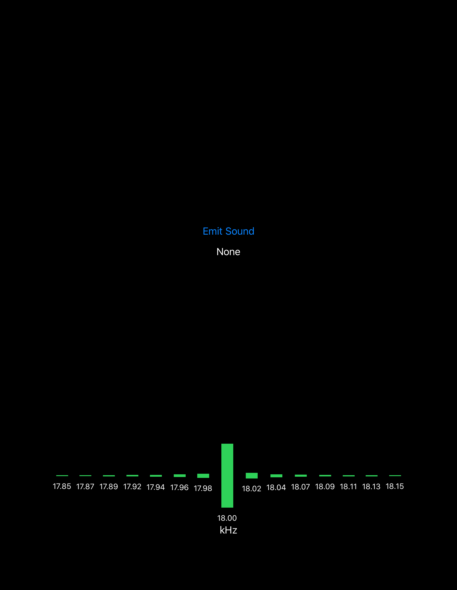

# Soundwave
Implementation of Soundwave [1] on IOS devices.

Soundwave sends a high frequency signal (18 Khz, usually inaudible) through speaker and receives reflections of the signal through micorphone. Then it uses doppler effect generated by moving hand (when positioned near the speaker and microphone) to estimate whether the user gesture is "push" or "pull". 

## Run
Simply compile and run in xcode!

## Main interface
Here is the main interface of soundwave. By pressing the button of "Emit Signal", the soundwave system will begin operational, calculating doppler effect and displaying frequency changes. The system will stop automatically after 10 seconds.

Below the button is result of gesture classification. It can be "push", "pull" or "none", the last of which suggests there is no significant Doppler effect to indicate movement.

At the buttom of the screen, it displays, in real-time, the magnitude for each frequency (as magnified outputs from FFT). User gestures of "push" and "pull" will generate a strong and clearly visible Dopploer effect here.

Note: to re-run soundwave, user will need to restart the application. In other words, the "Emit Signal" button can be used only once per launch.

## Requirement
This code uses SwiftUI, so it requires target devices to be at IOS 13 or later.

## Limitations
This code has been tested thoroughly on iPad 6th generation. Note that the code requires sample rate of input and output to be at 44.1 Khz. Since some Apple devices may have a different sample rate, e.g. 48 Khz, rurnning the program at those frequency may generate errors. This is because the signal generator of the code may generate a different frequency, biasing the results in the classifier. 

## References
[1] Gupta, Sidhant, et al. “SoundWave: Using the Doppler Effect to Sense Gestures.” Proceedings of the 2012 ACM Annual Conference on Human Factors in Computing Systems - CHI ’12, ACM Press, 2012, p. 1911. DOI.org (Crossref), doi:10.1145/2207676.2208331.
